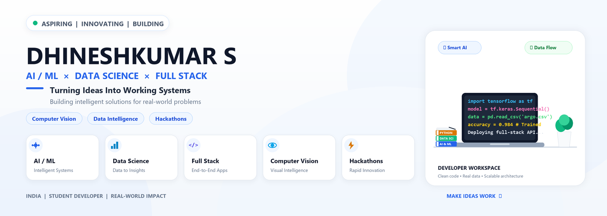

<div align="center">
  
</div>

<br>

<div align="center">

### AI / ML  ×  DATA SCIENCE  ×  FULL STACK

**Turning Ideas Into Working Systems**

---

</div>

## 👋 Profile Identity

Hi, I'm **DHINESHKUMAR S**, an aspiring **AI/ML, Data Science, and Full-Stack Developer**.

I specialize in building end-to-end intelligent applications by connecting machine learning models with robust web interfaces and data analytical pipelines. My focus is on turning complex problem statements into functional, real-world systems.

---

## 👨‍💻 About Me

- 🔬 Passionate about **Artificial Intelligence**, **Machine Learning**, and **Computer Vision**.
- 📊 Experienced in **Data Science** and **Data Analytics** for extracting actionable insights from data.
- 💻 Skilled in **Full-Stack Web Development** using modern frameworks and APIs.
- ⚡ Enthusiastic about **Hackathon Development** and rapid software prototyping.
- 🎯 Dedicated to creating practical, clean, and scalable technology solutions.

### 🎯 My Approach

```text
PROBLEM
   ↓
DATA
   ↓
INTELLIGENCE
   ↓
APPLICATION
   ↓
REAL-WORLD IMPACT
```

---

## 🎯 Core Fields

- **AI / ML**: Machine Learning Models, Predictive Analytics & Intelligent Systems
- **Data Science & Analytics**: Data Preprocessing, Exploratory Data Analysis & Insight Generation
- **Computer Vision**: Image Processing, Object Detection & Visual Intelligence
- **Full-Stack Development**: Responsive Web Interfaces, RESTful APIs & Backend Architecture
- **Web Applications**: Scalable Frontend & Database Integration
- **Real-World Problem Solving**: End-to-End System Design for Practical Applications
- **Hackathons**: Rapid Prototyping & Functional Product Demos

---

## 🛠️ Tech Stack

| Category | Technologies & Tools |
| :--- | :--- |
| **Programming** | Python • Java • JavaScript • TypeScript |
| **AI / ML / Data** | Artificial Intelligence • Machine Learning • Data Science • Data Analytics • Computer Vision |
| **Frontend** | React • Vite • HTML5 • CSS3 |
| **Backend** | FastAPI • Node.js |
| **Databases** | Supabase • MongoDB |
| **Version Control & Tools** | Git • GitHub • VS Code |

---

## 🚀 Featured Projects

### ⚖️ [LexiAssist](https://github.com/Dhinesh2510-hub/LexiAssist-AI-Legal-Assistant) — AI Legal Assistant
An intelligent legal assistant designed to simplify complex legal documents and provide quick, context-aware legal information using AI language models.
- **Focus**: AI / ML, Natural Language Processing, Legal Tech

### 🌊 GroundWater AI — Real-Time Groundwater Intelligence
An AI-driven solution for analyzing groundwater data, forecasting water availability, and enabling sustainable water resource management.
- **Focus**: Data Science, Machine Learning, Environmental Analytics

### 🛥️ FloatChat — Ocean Data Intelligence / ARGO
An interactive data intelligence interface designed to query, visualize, and analyze oceanographic ARGO float data.
- **Focus**: Data Science, AI Chat Interface, Data Visualization

### 🌿 EcoBrain AI — Waste Classification / Computer Vision
A computer vision model built for real-time waste identification and automated sorting to promote efficient recycling workflows.
- **Focus**: Computer Vision, Image Classification, Deep Learning

### 📦 [TrackPort](https://github.com/Dhinesh2510-hub/Shipping-Tracking) — Shipment Tracking & Logistics
A full-stack logistics management platform providing real-time shipment tracking, route visibility, and status updates.
- **Focus**: Full-Stack Development, React, FastAPI, Interactive Mapping

---

## 📊 Data Science Workflow

```text
RAW DATA
   ↓
DATA CLEANING
   ↓
EXPLORATORY ANALYSIS
   ↓
FEATURE ENGINEERING
   ↓
MODEL TRAINING
   ↓
EVALUATION
   ↓
VISUALIZATION
   ↓
REAL-WORLD INSIGHT
```

---

## 🔄 Development Workflow

```text
IDEA  →  RESEARCH  →  DESIGN  →  BUILD  →  TEST  →  DEPLOY  →  IMPROVE
```

---

## ⚡ Hackathon Mindset

I thrive in fast-paced collaborative environments where rapid innovation is key:
- **Rapid Prototyping**: Building functional minimal viable products under tight timelines.
- **Pragmatic Problem Solving**: Analyzing problem statements and executing high-value technical solutions.
- **Functional Demos**: Delivering working software demos rather than static mockups.
- **Continuous Learning**: Quickly adapting to and integrating new technologies and frameworks.

---

## 📚 Currently Learning

- 🧠 **Advanced AI / ML**: Deep Learning Architectures & LLM Integration
- 📈 **Data Science**: Advanced Feature Engineering & Time Series Analysis
- 👁️ **Computer Vision**: Real-time Object Tracking & Spatial AI
- 🌐 **Full-Stack Development**: Microservices & Production-Grade API Design
- ⚙️ **Data Engineering**: Data Pipelines & Cloud Infrastructure
- ☁️ **Cloud Deployment**: Containerization & Scalable Deployment Strategies

---

## 📈 GitHub Statistics

<div align="center">
  
  
</div>

---

## 📬 Contact & Connect

- **GitHub**: [@Dhinesh2510-hub](https://github.com/Dhinesh2510-hub)

---

<div align="center">
  <sub>Designed & Maintained by <b>DHINESHKUMAR S</b> • Minimal Professional Light Theme</sub>
</div>
