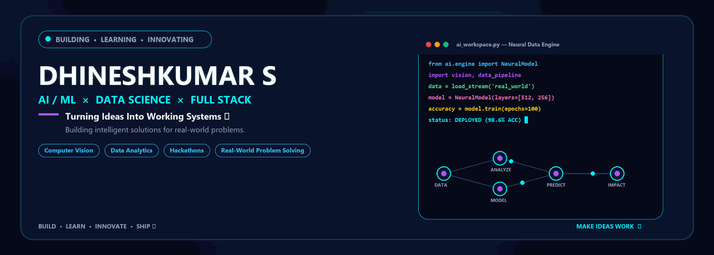

<div align="center">
  <picture>
    <source media="(prefers-color-scheme: dark)" srcset="./assets/profile-banner.gif">
    
  </picture>
</div>

<br>

<div align="center">

  <a href="https://git.io/typing-svg">
    
  </a>

</div>

<br>

<table width="100%" align="center">
  <tr>
    <td width="40%" valign="top" style="background-color: #0b132b; border: 1px solid #1e3050; border-radius: 12px; padding: 18px;">
      <h3 align="center" style="color: #00f0ff; margin-top: 0;">⚡ DEVELOPER IDENTITY</h3>
      <h2 align="center" style="color: #ffffff; margin-bottom: 5px;">DHINESHKUMAR S</h2>
      <p align="center" style="color: #a855f7; font-weight: bold;">AI / ML × DATA SCIENCE × FULL STACK</p>
      <hr style="border: 1px solid #1e3050;">
      <p style="color: #94a3b8; font-size: 13px;">
        • 🤖 <b>AI / ML Developer</b><br>
        • 📊 <b>Data Science & Analytics</b><br>
        • 💻 <b>Full-Stack Developer</b><br>
        • 👁️ <b>Computer Vision Innovator</b><br>
        • 🚀 <b>Hackathon Builder</b>
      </p>
    </td>
    <td width="60%" valign="top" style="background-color: #0b132b; border: 1px solid #1e3050; border-radius: 12px; padding: 18px;">
      <h3 style="color: #00f0ff; margin-top: 0;">🌐 ABOUT ME</h3>
      <p style="color: #e2e8f0; font-size: 15px; line-height: 1.6;">
        <i>"Building intelligent solutions using AI, data, and modern web technologies."</i>
      </p>
      <p style="color: #94a3b8; font-size: 14px; line-height: 1.6;">
        I am an aspiring developer focused on engineering real-world systems. I bridge the gap between machine learning intelligence, computational vision, and production-ready full-stack applications.
      </p>
      <p style="color: #38bdf8; font-size: 13px; font-weight: bold;">
        ● Status: BUILDING • LEARNING • INNOVATING
      </p>
    </td>
  </tr>
</table>

<br>

## 🧠 AI & Data Science Neural Engine

```gcode
┌────────────────────────────────────────────────────────────────────────────────────────┐
│ $ ai-pipeline --stream --mode=production                                               │
│                                                                                        │
│   [DATA] ──► [ANALYZE] ──► [MODEL] ──► [PREDICT] ──► [BUILD] ──► [REAL-WORLD IMPACT]   │
│                                                                                        │
│   Status: Neural data pipeline active. Converting raw data into intelligent systems.   │
└────────────────────────────────────────────────────────────────────────────────────────┘
```

---

## 🎯 Core Skill Cards

<table width="100%">
  <tr>
    <td width="33%" valign="top">
      <div style="background-color: #0b132b; border: 1px solid #1e3050; border-radius: 10px; padding: 12px;">
        <h4 style="color: #00f0ff; margin: 0;">🤖 AI / ML</h4>
        <p style="color: #94a3b8; font-size: 12px; margin-top: 6px;">Machine Learning Models, Predictive Analytics & Neural Architectures.</p>
      </div>
    </td>
    <td width="33%" valign="top">
      <div style="background-color: #0b132b; border: 1px solid #1e3050; border-radius: 10px; padding: 12px;">
        <h4 style="color: #38bdf8; margin: 0;">📊 Data Science</h4>
        <p style="color: #94a3b8; font-size: 12px; margin-top: 6px;">Data Preprocessing, Exploratory Analysis & Actionable Insights.</p>
      </div>
    </td>
    <td width="33%" valign="top">
      <div style="background-color: #0b132b; border: 1px solid #1e3050; border-radius: 10px; padding: 12px;">
        <h4 style="color: #a855f7; margin: 0;">📈 Data Analytics</h4>
        <p style="color: #94a3b8; font-size: 12px; margin-top: 6px;">Statistical Modeling, Metric Dashboards & Data Pipelines.</p>
      </div>
    </td>
  </tr>
  <tr>
    <td width="33%" valign="top">
      <div style="background-color: #0b132b; border: 1px solid #1e3050; border-radius: 10px; padding: 12px;">
        <h4 style="color: #818cf8; margin: 0;">💻 Full Stack</h4>
        <p style="color: #94a3b8; font-size: 12px; margin-top: 6px;">Responsive Web Interfaces, RESTful APIs & Microservices.</p>
      </div>
    </td>
    <td width="33%" valign="top">
      <div style="background-color: #0b132b; border: 1px solid #1e3050; border-radius: 10px; padding: 12px;">
        <h4 style="color: #38bdf8; margin: 0;">👁️ Computer Vision</h4>
        <p style="color: #94a3b8; font-size: 12px; margin-top: 6px;">Object Detection, Image Segmentation & Spatial Intelligence.</p>
      </div>
    </td>
    <td width="33%" valign="top">
      <div style="background-color: #0b132b; border: 1px solid #1e3050; border-radius: 10px; padding: 12px;">
        <h4 style="color: #f59e0b; margin: 0;">🚀 Hackathons</h4>
        <p style="color: #94a3b8; font-size: 12px; margin-top: 6px;">Rapid Prototyping, Agile Problem Solving & Functional Demos.</p>
      </div>
    </td>
  </tr>
</table>

---

## 🛠️ Tech Stack Matrix

<div align="center">

| Category | Futuristic Tech Stack Badges |
| :--- | :--- |
| **Languages** |     |
| **AI / ML / Data** |     |
| **Web & Frameworks** |    |
| **Database & Tools** |     |

</div>

---

## 🚀 Featured Project Showcase

<table width="100%">
  <tr>
    <td width="50%" valign="top">
      <div style="background-color: #0b132b; border: 1px solid #00f0ff; border-radius: 12px; padding: 16px;">
        <h3 style="color: #00f0ff; margin-top: 0;">⚖️ LEXIASSIST</h3>
        <p style="color: #e2e8f0; font-size: 13px;"><b>AI Legal Assistant</b></p>
        <p style="color: #94a3b8; font-size: 13px;">An intelligent legal assistant designed to simplify complex legal documents and provide quick, context-aware information using AI models.</p>
        <p style="color: #a855f7; font-size: 12px;"><b>Focus:</b> AI • NLP • Legal Tech • Full Stack</p>
        <a href="https://github.com/Dhinesh2510-hub/LexiAssist-AI-Legal-Assistant" style="color: #00f0ff; font-weight: bold; text-decoration: none;">VIEW PROJECT →</a>
      </div>
    </td>
    <td width="50%" valign="top">
      <div style="background-color: #0b132b; border: 1px solid #38bdf8; border-radius: 12px; padding: 16px;">
        <h3 style="color: #38bdf8; margin-top: 0;">💧 GROUNDWATER AI</h3>
        <p style="color: #e2e8f0; font-size: 13px;"><b>Real-Time Groundwater Intelligence</b></p>
        <p style="color: #94a3b8; font-size: 13px;">An AI-driven solution for analyzing groundwater levels, forecasting water availability, and enabling sustainable water resource management.</p>
        <p style="color: #a855f7; font-size: 12px;"><b>Focus:</b> Data Science • ML • Environmental Analytics</p>
        <span style="color: #64748b; font-size: 12px;">INTELLIGENCE SYSTEM</span>
      </div>
    </td>
  </tr>
  <tr>
    <td width="50%" valign="top">
      <div style="background-color: #0b132b; border: 1px solid #818cf8; border-radius: 12px; padding: 16px;">
        <h3 style="color: #818cf8; margin-top: 0;">🌊 FLOATCHAT</h3>
        <p style="color: #e2e8f0; font-size: 13px;"><b>Ocean Data Intelligence / ARGO</b></p>
        <p style="color: #94a3b8; font-size: 13px;">An interactive data intelligence interface designed to query, visualize, and analyze oceanographic ARGO float data in real-time.</p>
        <p style="color: #a855f7; font-size: 12px;"><b>Focus:</b> Data Science • AI Chat • Data Visualization</p>
        <span style="color: #64748b; font-size: 12px;">OCEAN DATA SYSTEM</span>
      </div>
    </td>
    <td width="50%" valign="top">
      <div style="background-color: #0b132b; border: 1px solid #a855f7; border-radius: 12px; padding: 16px;">
        <h3 style="color: #a855f7; margin-top: 0;">♻️ ECOBRAIN AI</h3>
        <p style="color: #e2e8f0; font-size: 13px;"><b>Waste Classification / Computer Vision</b></p>
        <p style="color: #94a3b8; font-size: 13px;">A computer vision model built for real-time waste identification and automated sorting to promote efficient recycling workflows.</p>
        <p style="color: #a855f7; font-size: 12px;"><b>Focus:</b> Computer Vision • Deep Learning • Image AI</p>
        <span style="color: #64748b; font-size: 12px;">VISION MODEL</span>
      </div>
    </td>
  </tr>
</table>

<br>

<table width="100%">
  <tr>
    <td width="100%">
      <div style="background-color: #0b132b; border: 1px solid #00f0ff; border-radius: 12px; padding: 16px;">
        <h3 style="color: #00f0ff; margin-top: 0;">🚢 TRACKPORT</h3>
        <p style="color: #e2e8f0; font-size: 13px;"><b>Shipment Tracking & Logistics</b></p>
        <p style="color: #94a3b8; font-size: 13px;">A full-stack logistics management platform providing real-time shipment tracking, route visibility, and status updates.</p>
        <p style="color: #a855f7; font-size: 12px;"><b>Focus:</b> Full-Stack • React • FastAPI • Interactive Mapping</p>
        <a href="https://github.com/Dhinesh2510-hub/Shipping-Tracking" style="color: #00f0ff; font-weight: bold; text-decoration: none;">VIEW PROJECT →</a>
      </div>
    </td>
  </tr>
</table>

---

## 📊 Data Science Pipeline

```gcode
RAW DATA ──► CLEAN ──► ANALYZE ──► VISUALIZE ──► MODEL ──► EVALUATE ──► INSIGHT ──► REAL-WORLD IMPACT
```

---

## 🔄 Development Workflow

```gcode
IDEA  ──►  RESEARCH  ──►  DESIGN  ──►  BUILD  ──►  TEST  ──►  DEPLOY  ──►  IMPROVE
```

---

## ⚡ Hackathon Terminal

```bash
$ hackathon --start

> FIND PROBLEM statement
> DESIGN SOLUTION architecture
> BUILD PROTOTYPE rapid MVP
> TEST functional performance
> DEMO working application
> IMPROVE based on feedback
```

---

## 📚 Currently Learning

```text
┌────────────────────────────────────────────────────────────────────────┐
│ 🧠 Advanced AI / ML: Deep Learning Architectures & LLM Integration     │
│ 📈 Data Science: Advanced Feature Engineering & Predictive Pipelines   │
│ 👁️ Computer Vision: Real-time Object Tracking & Spatial AI            │
│ 🌐 Full-Stack Development: Production Microservices & Scalable APIs   │
│ ⚙️ Data Engineering: Data Pipelines & Cloud Infrastructure           │
│ ☁️ Cloud Deployment: Containerization & Cloud Native Architecture      │
└────────────────────────────────────────────────────────────────────────┘
```

---

## 📈 GitHub Statistics & Matrix

<div align="center">
  
  
</div>

---

## 📬 Contact & Connect

<div align="center">

[](https://github.com/Dhinesh2510-hub)

</div>

---

<div align="center">
  <p style="color: #00f0ff; font-weight: bold;">
    BUILD  ──►  LEARN  ──►  INNOVATE  ──►  SHIP 🚀
  </p>
  <p style="color: #94a3b8; font-size: 13px;">
    AI/ML • Data Science • Full Stack • Computer Vision
  </p>
  <p style="color: #a855f7; font-weight: bold; letter-spacing: 2px;">
    MAKE IDEAS WORK.
  </p>
</div>
